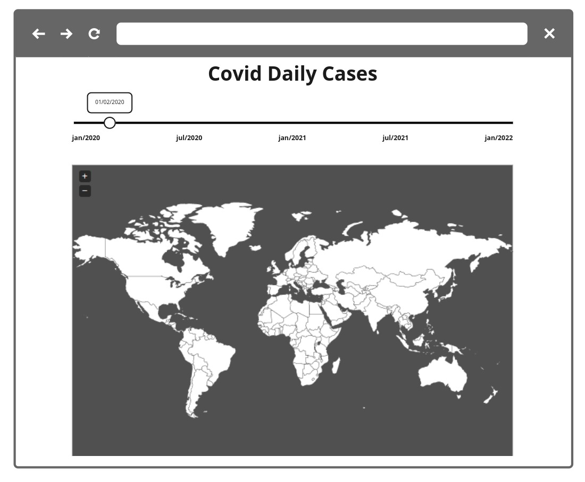

# Covid-Variants-app
> 
>This is a challenge by [Coodesh](https://coodesh.com/)
>
> 
---
> 
> LINK PARA TESTE: [Covid Variants App](https://covid-variant.netlify.app/)
>
> 

## Descrião do projecto

O projeto a ser desenvolvido por você tem como objetivo exibir o número de casos por país, dia e variante. Para isso será necessário gerar um gráfico que mostre o mapa mundi. Atente-se, ao desenvolver a aplicação front-end, para conceitos de usabilidade e adeque a interface com elementos visuais para os usuários do seu sistema.

 
- [V] Obrigatório 1 - Seguir o wireframe para a página de listagem dos dados;

- [V] Obrigatório 2 - Deve conter uma opção para alterar entre as datas disponíveis;

- [V] Obrigatório 3 - Desenvolver um select para que seja possível escolher entre exibir os dados de uma data ou os dados acumulados até aquela data;

- [V] Obrigatório 4 - Ao passar o mouse sobre um país, exiba seu nome e a quantidade de casos de cada variante registrados naquela data;

- [/] Diferencial 1 - Escrever Unit Tests ou E2E Test. Escolher a melhor abordagem e biblioteca;

- [V] Diferencial 2 - Configurar Docker no Projeto para facilitar o Deploy da equipe de DevOps;

- [V] Diferencial 3 - Colocar na URL os parametros utilizados na busca, para que seja possível compartilhar a URL;

- [--] Diferencial 4 - Implementar SSR no projeto;

- [/] Diferencial 5 - Adicionar um botão de "play" para exibir a evolução das dados automaticamente.

- [V] Diferencial 6 - Publique o projeto em alguma plataforma, como por exemplo a Vercel, Netlify ou outra de sua preferência.


### Exemplo:




##  Linguagem, Framework e/ou tecnologias Usadas

- [Vue.Js 2](https://v2.vuejs.org/)
- [Quasar Framework v1](https://v1.quasar.dev/)
- [Netlify](https://www.netlify.com/)


- [Supabase](https://supabase.com/)
- [Vuex](https://vuex.vuejs.org/)
- [chart.js](https://www.chartjs.org/)  
- [chartjs-chart-geo](https://www.npmjs.com/package/chartjs-chart-geo)  
- [world-atlas](https://www.npmjs.com/package/world-atlas) 

## Rodar a aplicação

* Remova o sufixo `.exemplo` nos arquivos: ```.development.env.exemplo``` para ```.development.env``` e ```.production.env.exemplo``` para ```.production.env``` 


### - #Quasar 

- Instalar as dependências:
```
cd pasta_projecto
yarn
```

- Inicie o aplicativo no modo de desenvolvimento (recarregamento de código ativo, relatório de erros etc.):
```
quasar dev
```

- Compile o aplicativo para produção:
```
quasar build
```

### - #Docker


```
docker build -t frontend .
```


```
docker run -d -p 8080:80 --rm frontend
```

